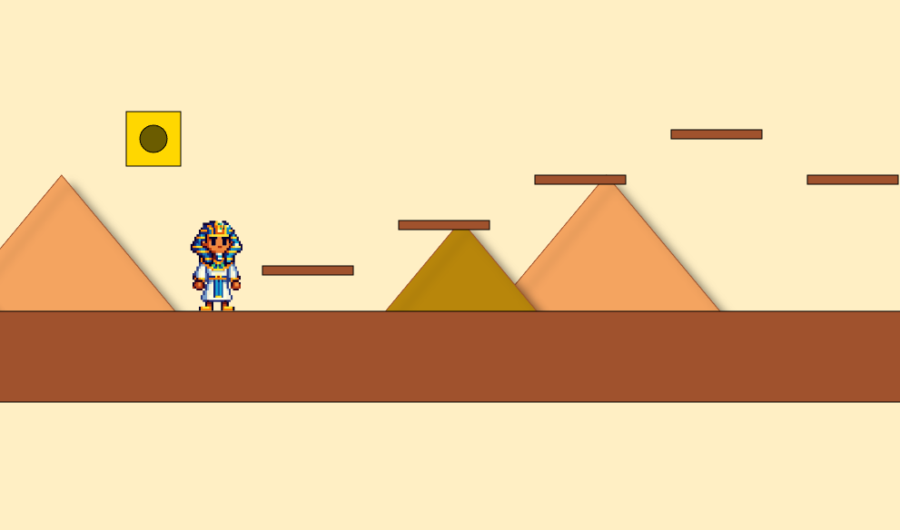

# Super Pharaoh

Super Pharaoh is a 2D side-scrolling platformer game built using HTML5 Canvas and JavaScript. It's mostly an experiment.



## Table of Contents

- [Features](#features)
- [Demo](#demo)
- [Installation](#installation)
- [Usage](#usage)
- [Contributing](#contributing)
- [License](#license)
- [Acknowledgements](#acknowledgements)

## Features

- 2D side-scrolling platformer gameplay
- Parallax background
- Smooth character movement and jumping
- Multiple platform types
- Simple collision detection

## Demo

You can play the game [here](rafa-net.github.io/super-pharaoh/).

## Installation

To run this project locally, follow these steps:

1. **Clone the repository:**

    ```sh
    git clone https://github.com/rafa-net/super-pharaoh.git
    ```

2. **Navigate to the project directory:**

    ```sh
    cd super-pharaoh
    ```

3. **Open `index.html` in your browser:**

    ```sh
    open index.html
    ```

## Usage

- Use the arrow keys to move the character:
  - ⬅️ Move left
  - ➡️ Move right
  - Press the ␣ (spacebar) to jump.
  
## Contributing

Contributions are welcome! If you have suggestions for improvements or new features, feel free to:

1. Fork the repository.
2. Create a new branch (`git checkout -b feature/added-fireball-powerup`).
3. Make your changes.
4. Commit your changes (`git commit -m 'Add fireball powerup feature'`).
5. Push to the branch (`git push origin feature/added-fireball-powerup`).
6. Open a Pull Request.

If you develop a whole new fork, please make sure to mention me :D

## License

This project is licensed under the MIT License - see the [LICENSE](LICENSE) file for details.

## Acknowledgements

- Inspired by classic platformer games like Super Mario and Sonic the Hedgehog.

